# Behavioral Cloning Project

[](http://www.udacity.com/drive)


The Project
---

The goals / steps of this project are the following:

* Use the [simulator](https://github.com/udacity/self-driving-car-sim) to collect data of good driving behavior 
* Design, train and validate a model that predicts a steering angle from image data
* Use the model to drive the vehicle autonomously around the first track (lake track) in the simulator. The vehicle should remain on the road for an entire loop around the track.
* Summarize the results with a written report

My project includes the following files:

* model.py containing the script to create and train the model
* drive.py for driving the car in autonomous mode
* model.h5 containing a trained convolution neural network 
* writeup_report.md summarizing the results

## Overview of the behavior cloning process

To enable the driving behavior cloning, first a suitable end to end learning neural network model is created and then the driving data (i.e. camera images and steering angles) is collected from the test track. These recorded data is preprocessed and feed to the model input layer. By training the neural network model, it learns how to predict the steering angle based on the real-time camera images as an input.

### Dependencies
This project uses the following libraries:
- os
- argparse

- matplotlib.image as mpimg
- matplotlib.pyplot
- numpy as np
- csv
- pandas

- cv2

- sklearn.model_selection
- sklearn.utils
- keras.models
- keras.optimizers
- keras.callbacks
- keras.layers

## Details About Files In This Directory


### About `drive.py`

Once the model is trained and saved using:

```python
model.save('model.h5')
```

It can be used with `drive.py` using this command:

```sh
python drive.py model.h5
```

The above command will load the trained model and use the model to make predictions on individual images in real-time and send the predicted angle back to the server via a websocket connection using [socket.io](https://socket.io) framework, which communicates with the [vehicle simulator] (https://github.com/udacity/self-driving-car-sim).

### Image format for OpenCV2
- Training images are read using `mpimg.imread()` to ensure images are processed correctly in the [Open CV2] (https://opencv.org) as it expects images in RGB.

#### 1. Submission includes all required files and can be used to run the simulator in autonomous mode

My project includes the following files:
* `model.py` containing the script to create and train the Keras convolution neural network model
* `drive.py` for driving the car in autonomous mode in the vehicle simulator
* `model.h5` containing a trained convolution neural network 
* `writeup_report.md` or writeup_report.pdf summarizing the results

#### 2. Submission includes functional code

Using the Udacity provided simulator and my drive.py file, the car can be driven autonomously around the track by executing

```sh
python drive.py model.h5
```

#### 3. Submission code is usable and readable

The `model.py` file contains the code for training and saving the convolution neural network. The file shows the pipeline I used for training and validating the model, and it contains comments to explain how the code works.

### Model Architecture and Training Strategy

#### 1. An appropriate model architecture has been employed

- Nivdia end to end learning model (with minor modification)
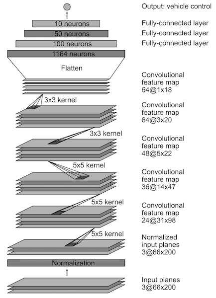

The convolutions model architecture selected is based on [Nvidia's end to end learning paper](https://images.nvidia.com/content/tegra/automotive/images/2016/solutions/pdf/end-to-end-dl-using-px.pdf) paper as suggested by Udacity, in which the model's steering angle prediction had been proven on a similar application, which consists of a Keras `Lambda` layer applying with normalization (model.py lines 74), followed by 3 Keras `Conv2D` layers of 5x5 filters with depth of 24,46,48 (model.py lines 77-79) then followed by 2 Keras `Conv2D` layers of 3x3 filters with depth of 64,64 (model.py lines 83-84). For introducing model non-linearity and regularization, each convolution filter is immediately followed by a [RELU activation] (https://en.wikipedia.org/wiki/Rectifier_(neural_networks) and [L2 regularization](http://www.robotics.stanford.edu/~ang/papers/icml04-l1l2.ps).

After series of convolutions, the layers are flattern and are connected with 3 layers of fully-connected layers of 100, 50, 10 before mapping to the final output to predict the steering angle.

#### 2. Attempts to reduce overfitting in the model
- L2 normalization is used

The model was trained and cross-validated on split data sets to ensure that the steering angle training data is not overfitting or underfitting to the model. The model was tested by running it through the simulator and ensuring that the vehicle could stay on the track. 

When a model does not have any regularzation defined in the neural network models, as the number of epoch increases during the training,the validation loss will eventually fluctuate or increase while the training loss reduces. For example, as shown below this is the training results with the best collected data *without* any regularizations like `Dropout` or L2 normalization `kernel_regularizer=l2()`.

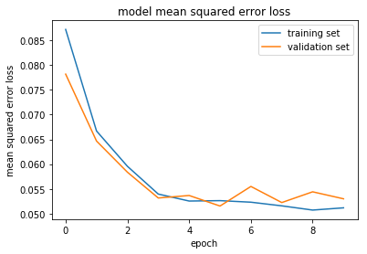

To combat the model overfitting problem, we could either use common random noise techniques such as `Dropout` or L2 normalization `W_regularizer=l2()`. Consideration and experimentation have been given to both techniques, it is found that L2 normalization is more effective than the `Dropout` for a faster and smoother training loss and also smoother steering prediction on the test track. Below is the training results with the L2 normalization `kernel_regularizer=l2(0.001)` defined at each hidden layer.

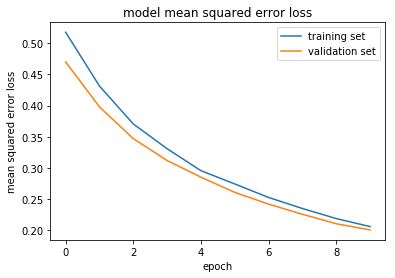

It was also mentioned in the paper [An Analysis of the Regularization between L2 and Dropout in Single Hidden Layer Neural Network](http://uksim.info/isms2016/CD/data/0665a174.pdf) that L2 regularization achieves higher perdiction accuracy than dropout for small number of hidden neurons. However, a rate of change in performance is significantly decreased in larger networks.

#### 3. Model parameter tuning

- optimizer: Adam
- learning rate: 1e-4
- L2 normalization penalty: 1e-3

The model used an Adam optimizer with a low learning rate (1e-4) rather than the popular learning rate of (1e-3), as it was chosen to minimize the loss fluctuations and the loss easier to converge during the training.

Adam optimizer is chosen over the stochastic gradeint descent (SGD) because the learning rate is mainted for each network weight (parameter) and separatedly adapted as learning unfolds, whereas the SGD maintain a single learning rate and does not change during training.

L2 normlization penalty value is chosen to be 1e-3 so that introduces a small degree of disturbance of training to help generalization. A higher penalty value is not recommended for this convolution model as it is a small network model, as it will add excessive noises to confuse the training for the model.

#### 4. Appropriate training data

Training data was chosen to keep the vehicle driving on the road. I used a combination of center lane driving, number of repeated sharp turns, recovering from the left and right sides of the road.

For details about how I created the training data, see the next section. 

#### 1. Solution Design Approach

The overall strategy for driving a model architecture was to start with picking the right type of neural network models, find a closest neural network model that is similar to this application, then gradually make minor modification to the model to improve the model performance, that is prediction of the steering angle based on the real-time camera images.

My first step was to use a convolution neural network model similar to the Nvidia end to end learning for self-driving cars. I thought this model might be appropriate because it has a similar setup that takes the steering angle and 3 independent camera images.

In order to gauge how well the model was working, I split my image and steering angle data into a training and validation set in 80/20 ratio. I found that my first model had a low mean squared error (MSE) on the training set but a high mean squared error on the validation set. This implied that the model was overfitting. 

To combat the overfitting, I modified the model with L2 normalization to each hidden layer so that there are small degree of noises to generalize the training without distracting the layers learning the relevant features in the image to predict the steering angle.

The final step was to run the simulator to see how well the car was driving around track one (lake track). There were a few spots where the vehicle could fell off the track. The red arrow in the pictures show the path the car would have taken if the insufficient or unbalanced steering angles data in the training dataset.

- straight side yellow lines
- straight stone bridge
- piano side curb
- left turns
- right turns

| Potential problem spots   |  Location of the track   |
:--------------------------:|:-------------------------:
straight side yellow lines  |  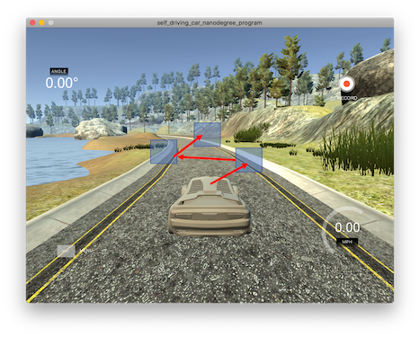
straight stone bridge       |  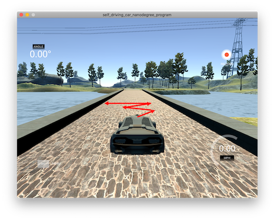
piano side curb             |  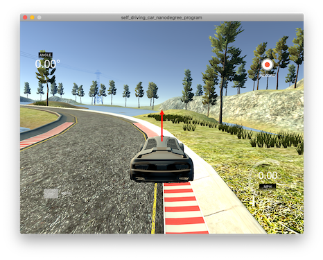
left turn                   |  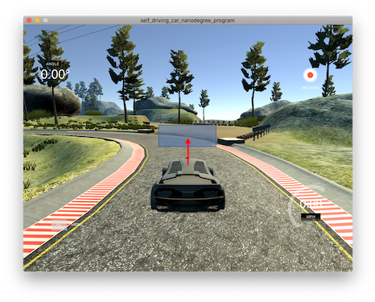
left turn                   |  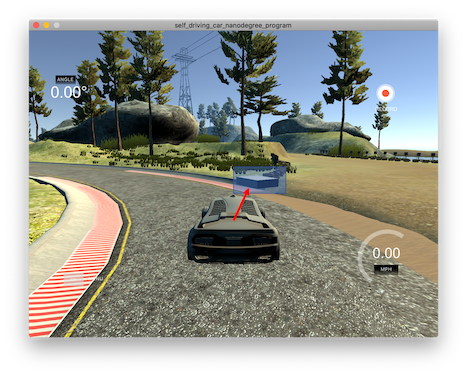
right turn                  |  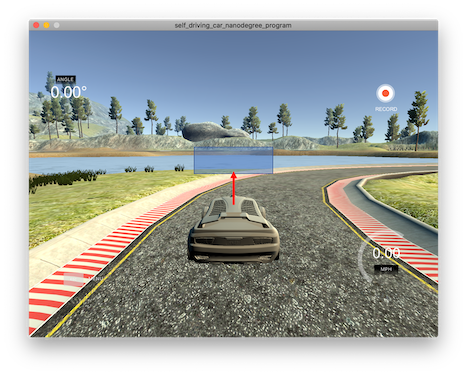
right turn                  |  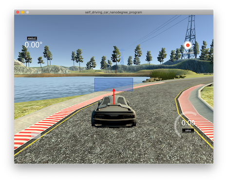

Ideally we would like to have a balanced dataset that looks similar to the normal distribution, like the one shown below.

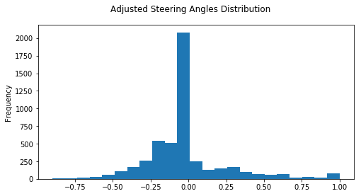

Notice the distribution is intentionally not to clip the close to neural steering angles excessively to become an exact normal distribution. This is intentionally, as majority of the roads in the test track is close to straight line. It is very important to ensure that the training model gets sufficient exposure to self-center the car in the straight line road in all different kind of road textures. This way the vehicle is "stablized" and won't wander within the lane before turning.

To improve the driving behavior in these cases, I further collected some more data around these potential problem spots.

For the straight side yellow lines, stone bridge and piano side curb, I took a few more equal number of samples driving clockwise and anti-clockwise.

To address the problems of the car fail to steer to the left and right turns, apart from collecting a few more equal number of run in the clockwise and anti-clockwise direction. It is also important to boost more samples with the larger steering angle as the car is approaching to the obstacle (as in the case of the square box in the left turn) or edge of track (of the right turn) by "**late turning**". This would add some more steering angles data points toward both ends of the steering angles distribution.


| BEFORE adding late turning     |  AFTER adding late turning   |
:-------------------------------:|:-----------------------------:
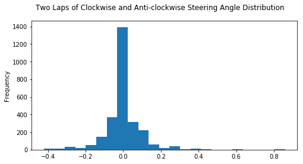  |  

At the end of the process, the vehicle is able to drive autonomously around the track without leaving the road.

#### 2. Final Model Architecture

The final model architecture (model.py lines 61-99) consisted of a convolution neural network with the following layers and layer sizes. Here is a visualization of the architecture:


#### 3. Creation of the Training Set & Training Process

Due to the oval shape nature of the first test track (lake track) in the simulator, the data collected on the track will be naturally skew to the left, which means we have a potential overfitting problem with the left turns and at the same time underfitting with the right turns. In fact, there is only one right turn and it is relatively sharper than the left turns, which makes steering angle prediction to be less accurate if not enough measurements are capturing the sharp right turn.

| After driving one lap in anti-clockwise direction  |  After driving two laps in anti-clockwise direction   |
:---------------------------------------------------:|:-----------------------------:
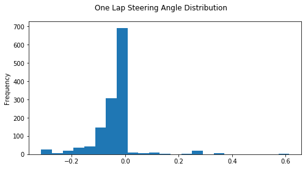   |  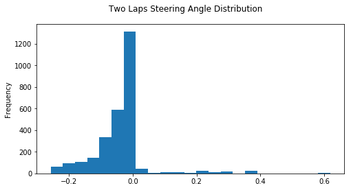

If we keep training the steering angle prediction model with this data, the model will "remember" the steering for th left turns and straight lines more and will becoming less effective in steering the car for the right turns, especially the number of epochs during the training increases.

To combat this non-uniform steering angle measurements distribution problem, one can either collect data with an even number of clockwise and anti-clockwise driving on the test track, or augment the track driving in one direction with horizontal flip using `np.fliplr(image)`.

To capture good driving behavior, I first recorded two laps on track one using center lane driving, one lap driving clockwise and another lap driving anti-clockwise. Here is an example image of center lane driving:

![][report_images/cropped_resized/bridge_center_camera.png]

After driving one lap in anti-clockwise and clockwise directions, the car is able to drive autonomously, however at times the car steering is jittery in straight-line. And sometimes after turning the corners, the car takes some time to recover to center within the lane. The distribution of the steering angles now looks like this.


To improve the self-centering performance if the vehicle is found out of the lane center, I then recorded the vehicle recovering from the left side and right sides of the road back to center so that the vehicle would learn to steer the vehicle back to the lane center if it is out of position. These images show what a recovery looks like starting from the right to left :


| recovery from the road side    |         recovering          |          recovered          |
:-------------------------------:|:---------------------------:|:---------------------------:|
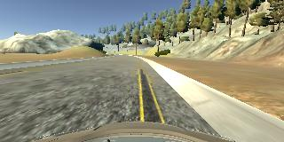 | 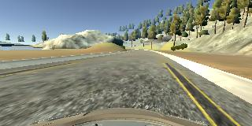    | 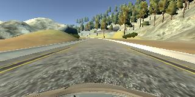  |


To augment the dataset, I also randomly flipped images and angles thinking that this would help to generalize the data and helps to combat the overfitting problem. For example, here is an image that has then been flipped:


| center camera image             | horizontal flip            |
:-------------------------------:|:---------------------------:|
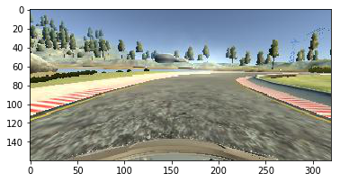  |  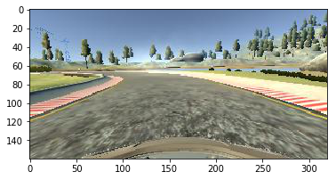


After the simulated ground truth data collection process, I had 56320 number of data points. I then preprocessed this data by cropping the top and the bottom of the images and resized images for both training datasets and real-time images used for prediction. The cropping of the images are aid to retain the useful features for the convolution networks to predict the steering angle based on the features in the simulated camera images.


I finally randomly shuffled the data set and put 20% of the data into a validation set. 

I used this training data for training the model. The validation set helped determine if the model was over or under fitting. As mentioned above, I have added L2 normalization regularization to each hidden layer, therefore  I don't have much problems with data overfitting. For my datasets the ideal number of epochs is around 10 as opposite to 20, which it has both lower training and validation loss. It may sound encounter intiutive, however there is a chance that the training dataset might overtrain and become too specific to the given training dataset and it is likely to fail to autonomously drive in another track. As for the learning rate and optimizer, I used an Adam optimizer so that manually training the learning rate wasn't necessary.

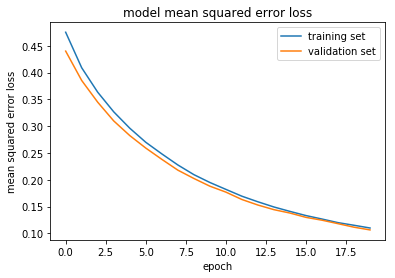

## References:

- [End to End Learning for Self-Driving Cars](https://arxiv.org/pdf/1604.07316.pdf)
- [An Analysis of the Regularization between L2 and Dropout in Single Hidden Layer Neural Network](http://uksim.info/isms2016/CD/data/0665a174.pdf)
